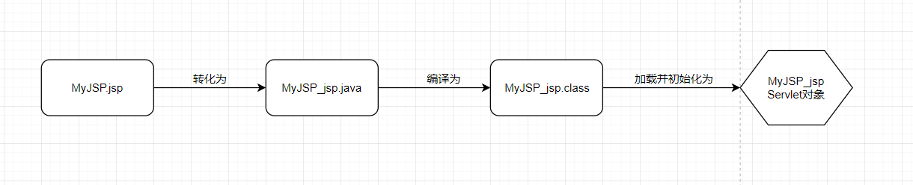

### JSP工作原理
容器拿到在JSP中写的代码，把这些代码转化为一个servlet类源(.java)文件，然后再把这个源文件编译为Java Servlet类。  
   

### 使用page指定导入包
    <%@page import="foo.*"%>
    <html>
    <body>
    The page count is:
    <%
        out.prinln(Counter.getCount());
    %>
    </body>
    </html>
2. 要导入多个包    

        <%@page import="foo.*,java.util.*"%>
        //使用逗号来分割多个包，整个包列表要用引号括起来  
`Java代码放在百分号的尖括号中间:<%xxx%>。而指令会为元素开始记号再增加一个字符@。`  
`如果以后看到以<%@开始的JSP代码，应该知道这是一个指令%>。`   
### JSP中的表达式
    //表达式语言
    <%=Counter.getCount()%>
scriptlet代码介于<% %>之间，表达式会为元素的开始记号再增加一个字符-----一个等于号(=)。  
### 三种不同类型的JSP元素
* scriptlet  &emsp;&emsp;&emsp;<% %>  
* 指令 &emsp;&emsp;&emsp;&emsp; <&@ &>
* 表达式 &emsp;&emsp;&emsp;<%= %>  
容器会拿到你在<% %>之间的键入的所有内容，并把它作为参数传递给打印语句。打印到隐式响应PrintWriter out中。  

当容器看到<%=Counter.getCount()%>时，会转换为`out.println(Counter.getCount());`   
### JSP中声明
    <%!count=0;%>
JSP声明所生成的servlet类的成员，这说明可以声明变量和方法。<%! %>标记之间的所有内容都会增加到类中，而且置于服务方法之间。  
#### 声明变量
<%! int count=0; %>  
#### 声明方法
    <%!
    int doubleCount(){
        count*=2;
        return count;
    }
    %>
### JSP中的三个指令
* page指令
`<%@page import="java.util.* "%>`    
定义页面的特定的属性，如字符编码，页面响应的内容类型，以及这个页面是否有隐式的绘画对象。   
#### page指令的属性  

##### import，导入类  
* contentType，定义JSP响应的MIME类型(和可选的字符编码)   
* isErrorPage，定义当前页面是否时另一个JSP的错误页面，默认值是false。  
* errorPage,定义一个资源的URL，如果有为捕获到的Throwable,就会发送给到这个资源。   

##### include指令 `<%@ include file="form.html" %>`    
定义在转化内时增加到当前页面的文本和代码，这样就能建立可重用的块，这些可重用的块能增加到各个页面上，而不必在每个JSP中把所有这些代码再重复一遍。  
