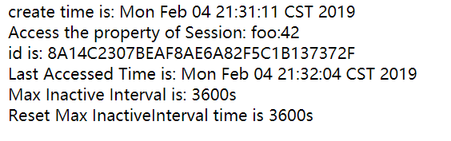

## Session对象
可以使用一个HttpSession对象保存跨多个请求的绘画状态，保存与该客户整个会话期间的会话状态。  
### 容器如何知道客户是谁？
对容器而言，每个请求都来自一个新的客户。  
1. Q为什么容器不使用IP地址来标识？  
*Head First Servlet & JSP* 中给出的解释是，对于服务器来说，你的IP地址是路由器的地址，所以不能唯一标识。但是抓包的时候不是显示出来每条报文会有源IP地址和目的IP地址吗？解释不清。。。虽然IP地址肯定无法标识用户。  
2. Ｑ用户登陆，连接时Https?  
大多数好的网站都指出"除非确实有必要，否则不应要求用户登录。"  
3. A客户需要一个唯一的会话ID  
对客户的第一个请求，容器会生成一个唯一的会话ID，并通过响应把他返回给客户，客户再再以后的每一个请求中发回这个会话ID，客户看到ID后，就会找到匹配的会话，并把这个会话与请求关联。  

#### 会话ID信息
最简单最常用的方式是通过Cookie交换这个会话ID信息。
## Cookie
容器几乎会做所有cookie工作，你必须告诉容器你想创建或者使用一个会话，但是除此之外，生成会话ID，创建新的Cookie对象，把会话ID放到Cookie中，把Cookie设置为响应的一部分等工作都由容器负责。对于后续的请求，容器会从请求中的Cookie得到会话ID，将这个会话ID与一个现有的会话匹配，并把会话与当前请求关联。　　

### 在响应中发送一个会话Cookie
### 从请求中得到会话ID
    HttpSession session=request.getSession();
请求无参数方法getSession()会返回一个会话，而不论是否已经有一个会话，所以要想知道会话是不是新建的，只有调用*isNew()* 方法。  

    public void doGet(HttpServletRequest request, HttpServletResponse response) throws IOException {
        request.setCharacterEncoding("utf-8");
        response.setCharacterEncoding("utf-8");
        response.setContentType("text/html;charset=utf-8");
        PrintWriter writer=response.getWriter();
        //用 getSession()方法 来新建会话对象Session,如果存在就返回HttpSession对象，否则新建一个Session对象
        HttpSession session=request.getSession();
        //isNew()方法判断是否为新会话
        if(session.isNew())
            writer.write("This is a new Session");
        else
            writer.write("Welcome back");
    }
#### 除此之外，可以调用带参数*getSession(false)* 方法  
如果session不存在，则返回null，否则返回一个已经存在的HttpSession     

        HttpSession session=request.getSession(false);
        if(session==null){
            out.println("no session was exist");
            out.println("make one");
            session=request.getSession();
        }else
        out.println("There was a session");
### 用户不接受Cookie，完成会话的方法
在请求中调用getSession(),容器会尝试使用Cookie。如果没有启用Cookie，这说明用户不会加入会话，会话的isNew()方法总会返回true  
### URL重写
如果用户不接受cookie，可以将URL重写作为一条后路，如果不能将ID放在一个Cookie中，URL重写能取得置于cookie中的会话ID，并将会话ID附加到访问应用的各个URL的最后。  
#### 重写原理 
假如一个web界面，其中每个连接都有一定额外的信息(会话ID)附加到URL的最后，当用户点击enhanced（前进）链接时，到达容器的请求会在最后携带着额外的这个信息，容器会取下请求的URL中这个额外部分，并用它查找匹配的会话。   
#### 不能使用cookie，而且只有告诉响应要对URL编码，URL重写才能奏效
        writer.write("<html><body>");
        //向这个url增加额外的会话信息
        writer.write("<a href=\""+response.encodeURL("index")+"\">click me</a>");
        writer.write("</body></html>");
cookie不能工作时，容器就会求助与URL重写，但是只有对响应中发送的所有URL完成了编码，此时URL重写才奏效。当容器看到你调用request.getSession(),而且认识到它要与这个客户建立一个新的会话，容器就会发回一个"双保险"响应，不仅针对会话ID有一个"set-cookie"首部，而且会向URL追加会话的ID(假设这里使用了response.encodeURL())。  
### 使用sendRedirect()的URL重写 
当想把一个请求重定向到另外一个URL，但是还是想使用一个会话，为此有个特俗的URL编码方法：  
*response.encodeRedirectURL("attr")*  

    public void doGet(HttpServletRequest request, HttpServletResponse response) throws IOException {
        request.setCharacterEncoding("utf-8");
        response.setCharacterEncoding("utf-8");
        response.setContentType("text/html;charset=utf-8");
    
        HttpSession session=request.getSession();
        //用在重定向中，而且还包含SessionID
        response.sendRedirect(response.encodeRedirectURL("attr"));
    }
**encodeRedirectURL()和encodeURL()的区别**  
1. encodeURL()方法用在servlet输出，例如输出a标签
2. encodeRedirectURL()用在重定向中*response.sendRedirect()*中，例如*response.sendRedirect(response.encodeRedirectURL("attr"));* 
>*encodeURL()* is used for all URLs in a servlet's output. It helps session ids to be encoded with the URL.  
*encodeRedirectURL()* is used with res.sendRedirect only. It is also used for encoding session ids with URL but only while redirecting.
### 关键的HttpSession方法
1. getCreationTime();  
返回第一次创建会话的时间，
2. getLastAccessedTime();  
返回容器最后一次得到有此会话ID的请求的时间(毫秒数)  
3. setMaxInactivateInterval()  
关于此会话，指定用户的最大时间间隔。如果过去了指定的时间内，而客户未对此会话做出任何请求，就会导致会话被撤销。可以用这个方法减少服务器中无用会话的个数。  
4. getMaxInactivateInterval()  
返回客户请求的最大间隔时间  
5. invalidate()  
结束会话，当前存储在这个会话中的所有会话属性也会解除绑定。  
### 设置会话超时
1. 会话有3种死法：  
* 超时
* 你在会话对象上调用invalidate()  
* 会话结束(崩溃或者取消部署)  
2. 编程实现  
* 在DD种配置会话超时  
在DD种配置会话超时与在所创建的每个会话上调用setMaxInactiveInterval()有同样的效果。   

  
        <web-app>
        <servlet>
            ...
        </servlet>
        <session-config>
            <session-timeout>15</session-timeout>
        </session-config>
        </web-app>
在dd种设置session-timeout单位是分钟，例如上例是15分钟。  
* 设置一个特定的会话的会话超时  

        session.setMaxInactiveInterval(20*60);
该方法的参数是以秒为单位，所以这标识为20分钟  
*如果会话过期了，再访问属性时候会出现IlegalStateException异常。*  
### session的过期
session经过测试，应该是浏览器关闭(所有标签页)，重新打开时，session重新创建。  

*一个session测试用例*

    public void doGet(HttpServletRequest request, HttpServletResponse response) throws IOException {
        request.setCharacterEncoding("utf-8");
        response.setCharacterEncoding("utf-8");
        response.setContentType("text/html;charset=utf-8");
        HttpSession session=request.getSession();
        PrintWriter writer=response.getWriter();
        session.setAttribute("foo",42);
        writer.println("create time is: "+new Date(session.getCreationTime()));
        writer.println(" Access the property of Session: foo:"+session.getAttribute("foo"));
        writer.println(" id is: "+session.getId());
        writer.println(" Last Accessed Time is: "+new Date(session.getLastAccessedTime()));
        writer.println(" Max Inactive Interval is: "+session.getMaxInactiveInterval()+"s");
        session.setMaxInactiveInterval(60*60);
        writer.write(" Reset Max InactiveInterval time is "+session.getMaxInactiveInterval()+"s");
    }
