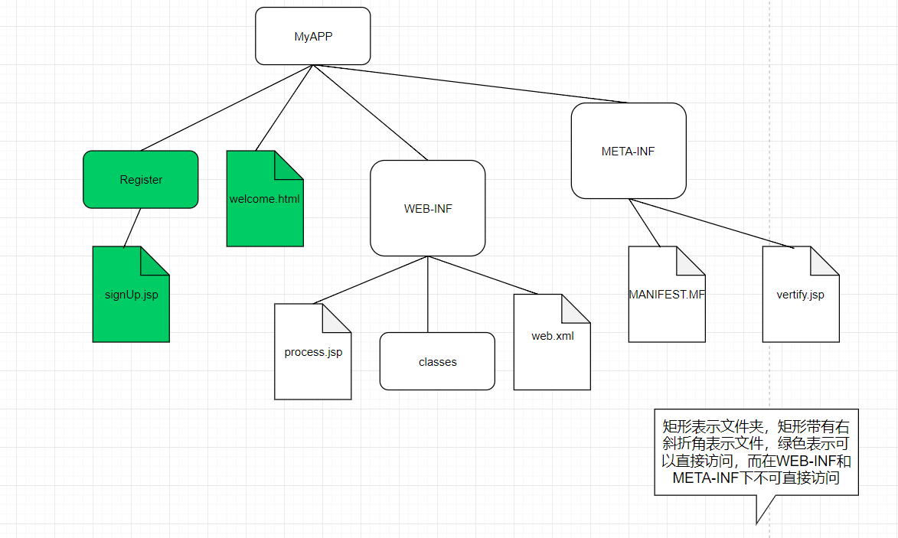

>本文介绍的内容有:web应用部署内容结构，servlet映射，
## Web应用部署
>WAR文件(Web归档，Web ARchive),JAR文件(JAVA Archive,Java归档)。  

1. 把应用依赖的包放在tomcat\lib下
2. 打成WAR包时，把整个项目的所有内容全部打包，WAR包名为项目的名字，放在tomcat\webapp下即可。tomcat会自动解压包。

## Servlet映射
三种`<url-pattern>元素`  
1. 完全匹配   

        <url-pattern>/Beer/Select</url-pattern>
        必须以一个斜线(/)开头
2. 目录匹配   

        <url-pattern>/Beer/*</url-pattern>
        必须以一个斜线(/)开头，总是以一个斜线加星号(/*)结束
3. 扩展名匹配   

        <url-pattern>*.do</url-pattern>
        必须以一个星号(*)开头(不能以斜线开头)，星号后面必须有一个点加扩展名(例如.do,.jsp)
### 匹配规则
1. 容器总会按下一页显示的顺序查找匹配，换句话说，首先查找完全匹配，如果找不到完全匹配，再查找目录匹配，如果目录匹配也查找不到，就查找扩展名匹配。
2. 如果一个请求与多个目录`<url-pattern>`匹配，容器会选择最长的匹配。
## 配置欢迎文件
如果键入web网站名，而没有指定的文件，通常还是能看到一个页面。    

        <web-app>
            <welcome-file-list>
                <welcome-file>index.html</welcome-file>
                <welcome-file>default.html</welcome-file>
            </welcome-file-list>
        </web-app>
只输入目录名，不输入具体的文件名。容器会根据welcome-file-list从上到下寻找默认的文件。容器再DD中寻找servlet映射，但是没有找到匹配，接下来，容器再welcome-file-list中寻找，依次的查找welcome-file访问。   

*出的一个错误是，不知道为什么WAR包解压出来的web.xml放在根目录中了，在根目录中的web.xml配置welcome-file-list毫无疑问是没有起作用的。要在WEB_INF目录下配置。*    
## 配置错误页面
1. 根据一个HTTP状态码声明错误页面    

        <error-page>
        <error-code>404</error-code>
        <location>/notFoundError.jsp</location>
        </error-page>
2. 声明一个"普遍"类型的错误页面    

        <error-page>
            <exception-type>java.lang.Throwable</exception-type>
            <location>/errorPage.jsp</location>
        </error-page>
3. 声明一个更明确的错误页面    

        <error-page>
            <exception-type>java.lang.ArithmeticException</exception-type>
            <location>/errorPage.jsp</location>
        </error-page>
可以在程序中发送错误   

        response.sendError(403);
## 配置Servlet初始化
servlet默认会在每一个请求到来时初始化，这说明，第一个客户要承受类加载，实例化和初始化(建立ServletContext，调用监听者等等)，然后容器才能正常工作，分配线程，并调用servlet的service()方法。    

 如果希望在部署时加载servlet，而不是等到第一个请求来加载。可以在DD中使用`<load-on-startup>1</load-on-startup>`的值非零时加载。值越小，越优先加载。    

    <!--配置第一个Servlet-->
    <servlet>
    <servlet-name>TestJSP</servlet-name>
    <servlet-class>foo.TestJsp</servlet-class>
    <!--预先加载-->
    <load-on-startup>1</load-on-startup>
    </servlet>